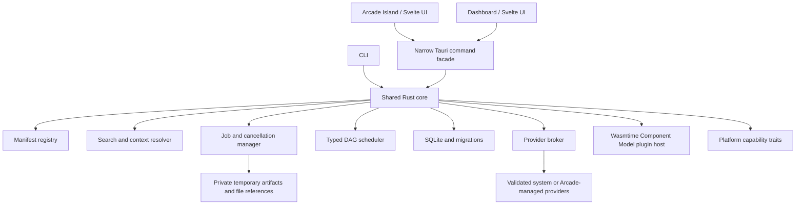

# Architecture

## Runtime shape

Rust owns durable state, permissions, tool resolution, provider execution, pipeline scheduling, and file/artifact handling. The webview renders and collects user choices; it does not receive large media buffers or arbitrary filesystem/shell access. CLI and GUI call the same core contracts.

## Boundaries

- **Catalog and registry:** validate stable IDs, API version, tool metadata, typed I/O, provider requirements, and permissions. The catalog is authoritative for search and category data.
- **Tool runtime:** dispatches a typed request to a built-in handler or sandboxed extension. It normalizes structured results and progress. Installed plugin manifests join the core registry. Execution uses WIT API v1 in an adjacent, short-lived `arcade-plugin-worker`; the main process does not initialize Wasmtime.
- **Provider broker:** maps capability requests to a verified system provider or Arcade-managed provider. Tools do not hardcode paths.
- **Job manager:** runs long work asynchronously, publishes rate-limited progress, cancels workers, records safe status, and cleans scoped partial artifacts.
- **Platform layer:** exposes explicit capability traits. OS-specific code lives behind adapters instead of per-tool platform branches.
- **Persistence:** SQLite stores metadata and references. Large media remains in files or private temporary artifacts.
- **UI shell:** exposes only the commands and scoped capabilities required by a window. Tauri capabilities and CSP remain narrow.

## Data path

User selections become scoped references. A tool consumes values tagged with MIME-like types and returns a structured result with output references, text, metadata, warnings, or errors. Pipeline edges pass handles/artifact references; they do not serialize multi-gigabyte files through frontend IPC. All process calls use an executable path plus structured argument vector, controlled environment, working directory, output limits, cancellation, and timeouts where applicable.

## Startup and performance

Measure cold and warm invocation before choosing how much UI to prewarm. The background process should remain event-driven while idle. Provider workers are started on demand and stopped when no longer needed. Cached provider state is reused at startup; missing providers can be rechecked, and opening Engines requests a full refresh. Link discovery and listening run off the UI thread. The desktop and CLI currently use different data directories/databases; their saved pipelines and history are not automatically shared (see [storage](storage.md)). Search indexing is built from manifests, aliases, phrases, usage, favorites, accepted input types, and current context.

## Decisions still requiring evidence

Keep the release-specific Tauri version, PDF/render stack, managed binary distribution, Wayland portal support, and provider minimum versions in ADRs and provider documentation. The plugin host currently pins Wasmtime 48.0.2 and WIT API v1; its execution limits and WASI context are documented in the plugin model. A chosen crate or runtime version must be rechecked against current upstream docs, platform behavior, and license metadata before it is added to a release build.
